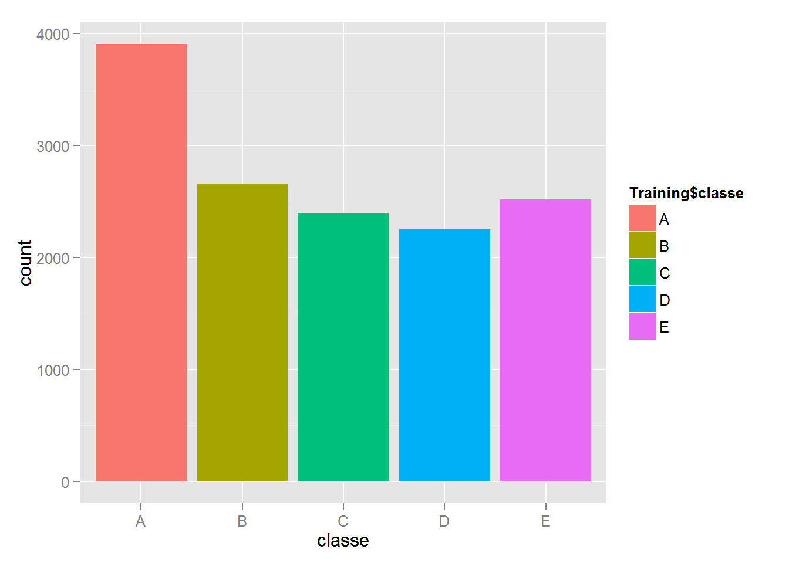
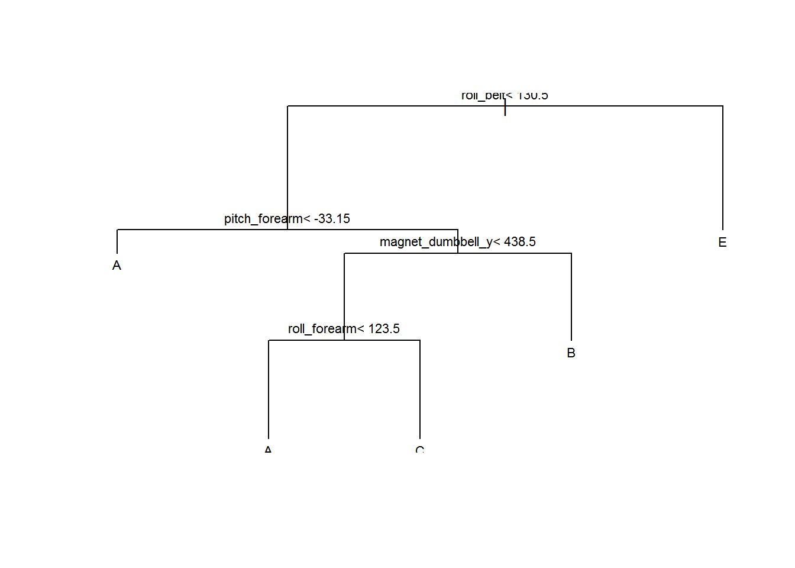
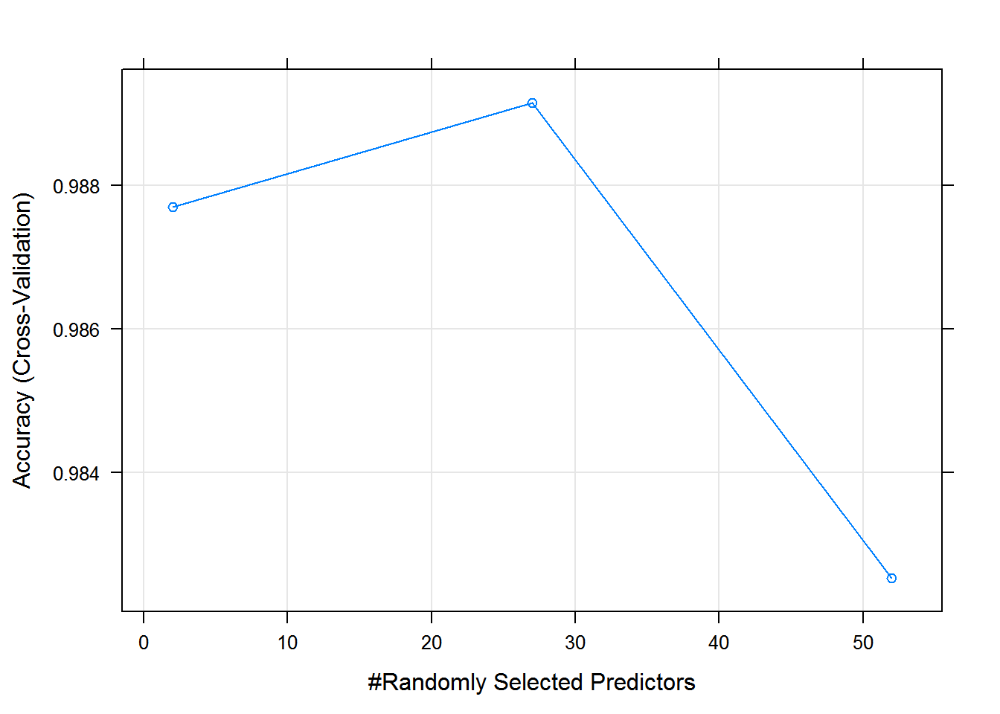
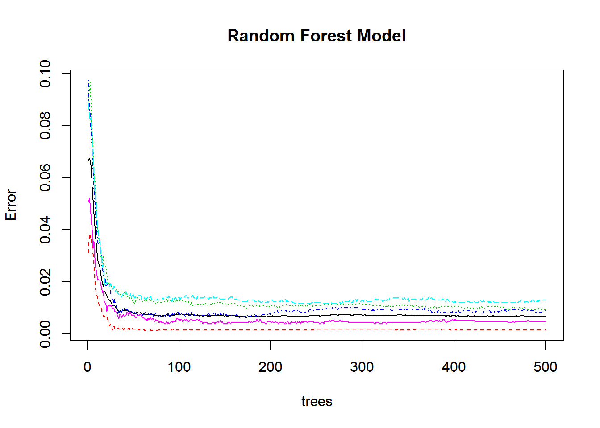
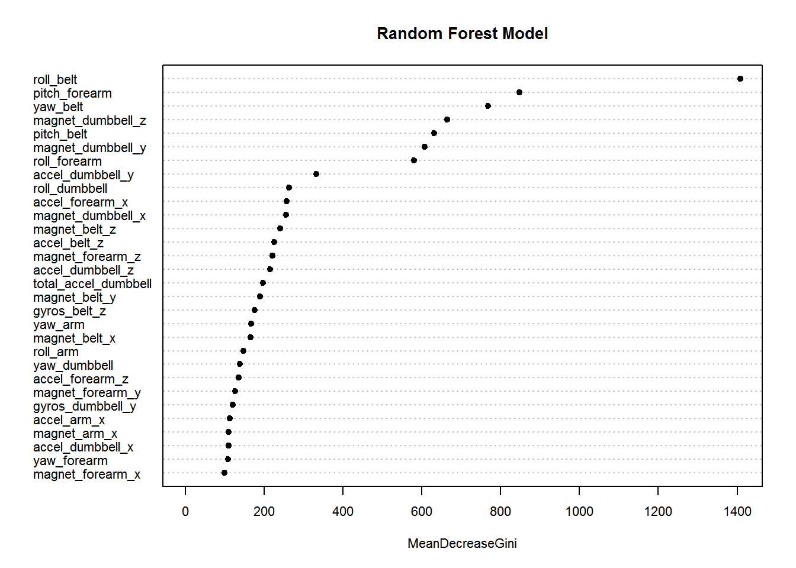

# Classifying Quality - Weight Lifting Exercises Dataset
Cristian Santa  
#Introduction
This human activity recognition research has traditionally focused on discriminating between different activities, i.e. to predict "which" activity was performed at a specific point in time (like with the Daily Living Activities dataset above). The approach we propose for the Weight Lifting Exercises dataset is to investigate "how (well)" an activity was performed by the wearer. The "how (well)" investigation has only received little attention so far, even though it potentially provides useful information for a large variety of applications,such as sports training.

In this work (see the paper) we first define quality of execution and investigate three aspects that pertain to qualitative activity recognition: the problem of specifying correct execution, the automatic and robust detection of execution mistakes, and how to provide feedback on the quality of execution to the user. We tried out an on-body sensing approach (dataset here), but also an "ambient sensing approach" (by using Microsoft Kinect - dataset still unavailable)

Six young health participants were asked to perform one set of 10 repetitions of the Unilateral Dumbbell Biceps Curl in five different fashions: exactly according to the specification (Class A), throwing the elbows to the front (Class B), lifting the dumbbell only halfway (Class C), lowering the dumbbell only halfway (Class D) and throwing the hips to the front (Class E).

Class A corresponds to the specified execution of the exercise, while the other 4 classes correspond to common mistakes. Participants were supervised by an experienced weight lifter to make sure the execution complied to the manner they were supposed to simulate. The exercises were performed by six male participants aged between 20-28 years, with little weight lifting experience. We made sure that all participants could easily simulate the mistakes in a safe and controlled manner by using a relatively light dumbbell (1.25kg).

###Background
Using devices such as Jawbone Up, Nike FuelBand, and Fitbit it is now possible to collect a large amount of data about personal activity relatively inexpensively. These type of devices are part of the quantified self movement - a group of enthusiasts who take measurements about themselves regularly to improve their health, to find patterns in their behavior, or because they are tech geeks. One thing that people regularly do is quantify how much of a particular activity they do, but they rarely quantify how well they do it. In this project, your goal will be to use data from accelerometers on the belt, forearm, arm, and dumbell of 6 participants. They were asked to perform barbell lifts correctly and incorrectly in 5 different ways. More information is available from the website here: <http://groupware.les.inf.puc-rio.br/har> (see the section on the Weight Lifting Exercise Dataset). 

###Data 
The training data for this project are available here: 
<https://d396qusza40orc.cloudfront.net/predmachlearn/pml-training.csv>

The test data are available here: 
<https://d396qusza40orc.cloudfront.net/predmachlearn/pml-testing.csv>

The data for this project come from this source: <http://groupware.les.inf.puc-rio.br/har>. If you use the document you create for this class for any purpose please cite them as they have been very generous in allowing their data to be used for this kind of assignment.

#Getting and Cleaning Data

```r
suppressMessages(library(caret))
suppressMessages(library(rpart))
suppressMessages(library(randomForest))
suppressMessages(library(parallel))
suppressMessages(library(doParallel))

TrainData<-read.csv('pml-training.csv',header=T,na.strings=c("NA","#DIV/0!",""))
TestData<-read.csv('pml-testing.csv',header=T,na.strings=c("NA","#DIV/0!",""))

namesTrain<-colnames(TrainData)
namesTest<-colnames(TestData)
```

Too many columns of the dataset have NA's, so let's clean the Training and Testing Data removing the columns of the dataset.


```r
#count the non NA's per column of the dataset
noNA<-as.vector(apply(TrainData, 2, function(x) length(which(!is.na(x)))))
coldrop<-c()
for(i in 1:length(noNA))
{
   if(noNA[i]<nrow(TrainData))
   {
      coldrop<-c(coldrop,namesTrain[i])
   }
}

TrainData<-TrainData[,!(namesTrain %in% coldrop)]
TrainData<-TrainData[,8:length(names(TrainData))]

TestData<-TestData[,!(namesTest %in% coldrop)]
TestData<-TestData[,8:length(names(TestData))]
```

Let's check if covariates have variability.


```r
nearZeroVar(TrainData,saveMetrics=T)
```

```
##                      freqRatio percentUnique zeroVar   nzv
## roll_belt             1.101904     6.7781062   FALSE FALSE
## pitch_belt            1.036082     9.3772296   FALSE FALSE
## yaw_belt              1.058480     9.9734991   FALSE FALSE
## total_accel_belt      1.063160     0.1477933   FALSE FALSE
## gyros_belt_x          1.058651     0.7134849   FALSE FALSE
## gyros_belt_y          1.144000     0.3516461   FALSE FALSE
## gyros_belt_z          1.066214     0.8612782   FALSE FALSE
## accel_belt_x          1.055412     0.8357966   FALSE FALSE
## accel_belt_y          1.113725     0.7287738   FALSE FALSE
## accel_belt_z          1.078767     1.5237998   FALSE FALSE
## magnet_belt_x         1.090141     1.6664968   FALSE FALSE
## magnet_belt_y         1.099688     1.5187035   FALSE FALSE
## magnet_belt_z         1.006369     2.3290184   FALSE FALSE
## roll_arm             52.338462    13.5256345   FALSE FALSE
## pitch_arm            87.256410    15.7323412   FALSE FALSE
## yaw_arm              33.029126    14.6570176   FALSE FALSE
## total_accel_arm       1.024526     0.3363572   FALSE FALSE
## gyros_arm_x           1.015504     3.2769341   FALSE FALSE
## gyros_arm_y           1.454369     1.9162165   FALSE FALSE
## gyros_arm_z           1.110687     1.2638875   FALSE FALSE
## accel_arm_x           1.017341     3.9598410   FALSE FALSE
## accel_arm_y           1.140187     2.7367241   FALSE FALSE
## accel_arm_z           1.128000     4.0362858   FALSE FALSE
## magnet_arm_x          1.000000     6.8239731   FALSE FALSE
## magnet_arm_y          1.056818     4.4439914   FALSE FALSE
## magnet_arm_z          1.036364     6.4468454   FALSE FALSE
## roll_dumbbell         1.022388    84.2065029   FALSE FALSE
## pitch_dumbbell        2.277372    81.7449801   FALSE FALSE
## yaw_dumbbell          1.132231    83.4828254   FALSE FALSE
## total_accel_dumbbell  1.072634     0.2191418   FALSE FALSE
## gyros_dumbbell_x      1.003268     1.2282132   FALSE FALSE
## gyros_dumbbell_y      1.264957     1.4167771   FALSE FALSE
## gyros_dumbbell_z      1.060100     1.0498420   FALSE FALSE
## accel_dumbbell_x      1.018018     2.1659362   FALSE FALSE
## accel_dumbbell_y      1.053061     2.3748853   FALSE FALSE
## accel_dumbbell_z      1.133333     2.0894914   FALSE FALSE
## magnet_dumbbell_x     1.098266     5.7486495   FALSE FALSE
## magnet_dumbbell_y     1.197740     4.3012945   FALSE FALSE
## magnet_dumbbell_z     1.020833     3.4451126   FALSE FALSE
## roll_forearm         11.589286    11.0895933   FALSE FALSE
## pitch_forearm        65.983051    14.8557741   FALSE FALSE
## yaw_forearm          15.322835    10.1467740   FALSE FALSE
## total_accel_forearm   1.128928     0.3567424   FALSE FALSE
## gyros_forearm_x       1.059273     1.5187035   FALSE FALSE
## gyros_forearm_y       1.036554     3.7763735   FALSE FALSE
## gyros_forearm_z       1.122917     1.5645704   FALSE FALSE
## accel_forearm_x       1.126437     4.0464784   FALSE FALSE
## accel_forearm_y       1.059406     5.1116094   FALSE FALSE
## accel_forearm_z       1.006250     2.9558659   FALSE FALSE
## magnet_forearm_x      1.012346     7.7667924   FALSE FALSE
## magnet_forearm_y      1.246914     9.5403119   FALSE FALSE
## magnet_forearm_z      1.000000     8.5771073   FALSE FALSE
## classe                1.469581     0.0254816   FALSE FALSE
```

The Training Data are clean, we have 52 variables to predict the classe variable. Now let's create a partiton of the data set for fit the model.


```r
set.seed(201509)
inTrain<-createDataPartition(TrainData$classe,p=0.7,list=FALSE)
Training<-TrainData[inTrain,]
Testing<-TrainData[-inTrain,]
```

 

In the barplot we can see that the (Class A), which corresponds to exactly according to the specification is the higher frequency, in the second place throwing the hips to the front (Class E), the elbows to the front (Class B) is in 3rd place, lifting the dumbbell only halfway (Class C) in 4th and lowering the dumbbell only halfway (Class D) is in 5th place.

Let's fit the model with Tree technique for predict the class variable.

```r
model1<-train(classe~.,data=Training,method='rpart');model1
```

```
## CART 
## 
## 13737 samples
##    52 predictor
##     5 classes: 'A', 'B', 'C', 'D', 'E' 
## 
## No pre-processing
## Resampling: Bootstrapped (25 reps) 
## 
## Summary of sample sizes: 13737, 13737, 13737, 13737, 13737, 13737, ... 
## 
## Resampling results across tuning parameters:
## 
##   cp          Accuracy   Kappa       Accuracy SD  Kappa SD  
##   0.03468620  0.5115983  0.36461755  0.03823340   0.06274399
##   0.05920049  0.4078879  0.19469193  0.06009235   0.10023416
##   0.11840098  0.3306745  0.07059905  0.04201258   0.06390713
## 
## Accuracy was used to select the optimal model using  the largest value.
## The final value used for the model was cp = 0.0346862.
```

```r
pred1<-predict(model1,newdata=Testing)
```

 

Let's check the accuracy of the model with the confusion matrix.


```r
confusionMatrix(pred1,Testing$classe)
```

```
## Confusion Matrix and Statistics
## 
##           Reference
## Prediction    A    B    C    D    E
##          A 1533  460  478  433  167
##          B   20  405   29  159  138
##          C  115  274  519  372  318
##          D    0    0    0    0    0
##          E    6    0    0    0  459
## 
## Overall Statistics
##                                           
##                Accuracy : 0.4955          
##                  95% CI : (0.4826, 0.5084)
##     No Information Rate : 0.2845          
##     P-Value [Acc > NIR] : < 2.2e-16       
##                                           
##                   Kappa : 0.3405          
##  Mcnemar's Test P-Value : NA              
## 
## Statistics by Class:
## 
##                      Class: A Class: B Class: C Class: D Class: E
## Sensitivity            0.9158  0.35558  0.50585   0.0000  0.42421
## Specificity            0.6348  0.92710  0.77794   1.0000  0.99875
## Pos Pred Value         0.4992  0.53928  0.32478      NaN  0.98710
## Neg Pred Value         0.9499  0.85703  0.88174   0.8362  0.88506
## Prevalence             0.2845  0.19354  0.17434   0.1638  0.18386
## Detection Rate         0.2605  0.06882  0.08819   0.0000  0.07799
## Detection Prevalence   0.5218  0.12761  0.27154   0.0000  0.07901
## Balanced Accuracy      0.7753  0.64134  0.64189   0.5000  0.71148
```

The Tree model way isn't accurate. Let's see another technique, for example Random Forest models.


```r
#set.seed(201509)
model2<-train(classe~.,data=Training,method='rf',trControl=trainControl(method='cv',number=3));model2
```

```
## Random Forest 
## 
## 13737 samples
##    52 predictor
##     5 classes: 'A', 'B', 'C', 'D', 'E' 
## 
## No pre-processing
## Resampling: Cross-Validated (3 fold) 
## 
## Summary of sample sizes: 9157, 9159, 9158 
## 
## Resampling results across tuning parameters:
## 
##   mtry  Accuracy   Kappa      Accuracy SD   Kappa SD    
##    2    0.9880615  0.9848959  0.0006663899  0.0008438565
##   27    0.9898815  0.9871995  0.0012774603  0.0016155099
##   52    0.9843493  0.9801991  0.0029778168  0.0037665191
## 
## Accuracy was used to select the optimal model using  the largest value.
## The final value used for the model was mtry = 27.
```

```r
pred2<-predict(model2,newdata=Testing)
```

   

Let's check the accuracy of the model with the confusion matrix.


```r
confusionMatrix(pred2,Testing$classe)
```

```
## Confusion Matrix and Statistics
## 
##           Reference
## Prediction    A    B    C    D    E
##          A 1671   10    0    0    0
##          B    3 1121    4    0    1
##          C    0    8 1017    7    1
##          D    0    0    5  955    0
##          E    0    0    0    2 1080
## 
## Overall Statistics
##                                          
##                Accuracy : 0.993          
##                  95% CI : (0.9906, 0.995)
##     No Information Rate : 0.2845         
##     P-Value [Acc > NIR] : < 2.2e-16      
##                                          
##                   Kappa : 0.9912         
##  Mcnemar's Test P-Value : NA             
## 
## Statistics by Class:
## 
##                      Class: A Class: B Class: C Class: D Class: E
## Sensitivity            0.9982   0.9842   0.9912   0.9907   0.9982
## Specificity            0.9976   0.9983   0.9967   0.9990   0.9996
## Pos Pred Value         0.9941   0.9929   0.9845   0.9948   0.9982
## Neg Pred Value         0.9993   0.9962   0.9981   0.9982   0.9996
## Prevalence             0.2845   0.1935   0.1743   0.1638   0.1839
## Detection Rate         0.2839   0.1905   0.1728   0.1623   0.1835
## Detection Prevalence   0.2856   0.1918   0.1755   0.1631   0.1839
## Balanced Accuracy      0.9979   0.9913   0.9940   0.9948   0.9989
```

The Random Forest model is highly accurate, a few classes have been lost in the prediction. The Out of Sample Error for each model with its prediction in the Testing Data are:


```
## $OutSampleError_Tree
## [1] 0.504503
## 
## $Predict_Tree
##  [1] C A C A A C C A A A C C C A C A A A A C
## Levels: A B C D E
## 
## $OutSampleError_RForest
## [1] 0.006966865
## 
## $Predict_RForest
##  [1] B A B A A E D B A A B C B A E E A B B B
## Levels: A B C D E
```
